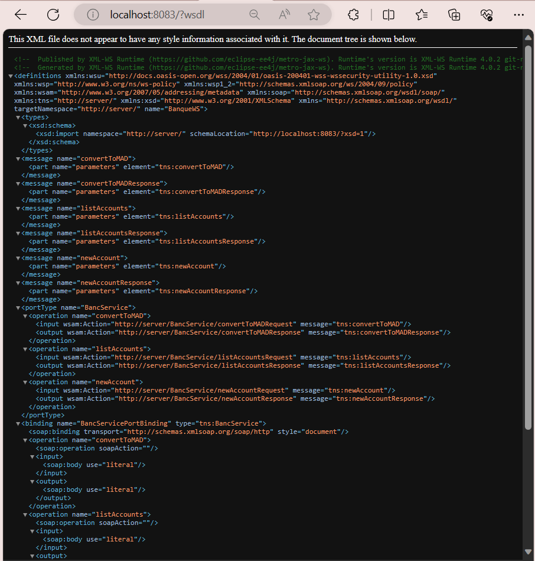
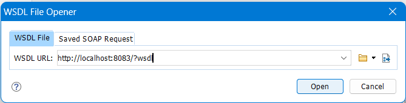

# AP1 : SOAP Web Services

## I- Vérification du fichier WSDL

## II- Configuration du WSDL File Opener dans Oxygen XML Editor

## III- Test de la méthode : `convertToMAD`

## IV- Test de la méthode : `newAccount`

## V- Test de la méthode : `listAccounts`

## VI- Test des méthodes avec Java : `JAX-WS`

